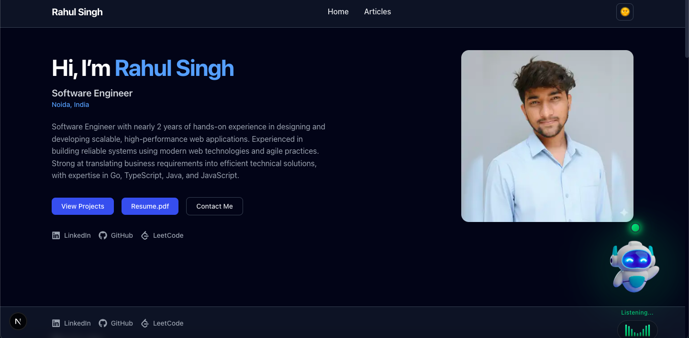

# AI Voice Portfolio

An interactive, modern developer portfolio built with **Next.js (App Router)**, **Tailwind CSS**, and an **AI assistant** powered by OpenAI.

## Photos / Screenshots

Add your own screenshots here (recommended: place images under `public/assets/images/` and reference them below).



It includes a classic portfolio layout (hero, projects, experience, skills, education, achievements, contact) plus API routes for:

- **AI assistance** (OpenAI Responses API proxy)
- **OpenAI Realtime session creation**
- **Contact form** email delivery via SMTP (Nodemailer)

>
> **Note:** This repo uses environment variables for OpenAI + SMTP. The server routes will return errors until you configure them.

---

## Features

- **Responsive portfolio UI** with sections for Projects, Experience, Skills, Education, Achievements, and Contact.
- **AI Assistant** UI component in the site (see `src/components/assistant/`).
- **OpenAI Responses proxy** endpoint at `POST /api/aiAssistance/responses`.
	- Supports both standard text responses and `json_schema` structured responses.
- **OpenAI Realtime session** endpoint at `GET /api/aiAssistance/session`.
	- Validates required env vars (`OPENAI_API_KEY`, `OPENAI_API_URL`, `OPENAI_MODEL`).
- **Contact form API** at `POST /api/contact` with basic validation.
	- Sends emails using SMTP credentials.
- **Animations** via Framer Motion + Lottie.

---

## Tech Stack

- **Next.js 15** (App Router)
- **React 19**
- **TypeScript**
- **Tailwind CSS**
- **Framer Motion**, **Lottie**
- **OpenAI SDK** (`openai`) + **@openai/agents**
- **Nodemailer** (contact email)

---

## Getting Started

### Prerequisites

- Node.js 18+ (recommended)
- npm (or your preferred package manager — scripts are npm-compatible)

### 1) Install dependencies

```bash
npm install
```

### 2) Configure environment variables

Create a local env file:

- `.env.local` (recommended for local dev)

This project loads env from `.env.local` and `.env` on the server (see `src/lib/envSetup.ts`).

#### OpenAI (AI Assistant)

Required for `GET /api/aiAssistance/session` and `POST /api/aiAssistance/responses`:

- `OPENAI_API_KEY` — your OpenAI API key
- `OPENAI_API_URL` — the URL used by `GET /api/aiAssistance/session` to create a realtime session
- `OPENAI_MODEL` — model name used by the session route

#### Contact form (SMTP)

Used by `POST /api/contact` (see `src/app/api/contact/route.ts` and `src/lib/mail.ts`):

- `SMTP_HOST`
- `SMTP_PORT`
- `SMTP_USER`
- `SMTP_PASS`
- `SMTP_FROM` — fallback recipient if `CONTACT_TO` is not set
- `CONTACT_TO` — (optional) admin recipient for contact submissions

> If neither `CONTACT_TO` nor `SMTP_FROM` is set, the contact endpoint will return a 500.

---

## Scripts

From `package.json`:

- `npm run dev` — start the dev server
- `npm run build` — production build
- `npm run start` — start production server
- `npm run lint` — run Next.js lint

---

## API Routes

### `GET /api/aiAssistance/session`

Creates an OpenAI Realtime session.

**Requires:** `OPENAI_API_KEY`, `OPENAI_API_URL`, `OPENAI_MODEL`

### `POST /api/aiAssistance/responses`

Proxy to OpenAI Responses API.

- If `body.text.format.type === "json_schema"`, it uses `responses.parse`.
- Otherwise it uses `responses.create`.

**Requires:** `OPENAI_API_KEY`

### `POST /api/contact`

Accepts JSON:

- `name`, `email`, `mobile`, `subject`, `message`

Performs basic validation and sends an email.

---

## Project Structure (high level)

```text
src/
	app/
		page.tsx                # Home page sections
		api/                    # Next.js route handlers
			aiAssistance/
			contact/
			otp/
	components/               # UI + sections + assistant
	data/                     # Portfolio content (projects, skills, etc.)
	lib/                      # server helpers (env, mail, templates)
	hooks/                    # custom hooks (audio recorder, theme, etc.)
```

---

## Deployment

This is a standard Next.js app and can be deployed to Vercel, Render, AWS, etc.

Key reminders:

- Configure all required environment variables on your host.
- Ensure your SMTP provider allows the deployment environment to send email.

---

## Troubleshooting

- **`Missing OPENAI_API_KEY`**: add it to `.env.local` and restart the dev server.
- **Contact API returns 500**: configure `SMTP_*` vars and also set `CONTACT_TO` or `SMTP_FROM`.
- **CORS issues**: AI routes apply CORS headers via `src/app/api/utils/cors.ts`.

---

## License

See `LICENSE`.

